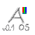

<div align="center">

## ArchaOS


</div>

### About

ArchaOS is in early development, targetting to be UNIX-like platform with inspiration from TempleOS. Uses GOP mode (UEFI graphics output protocol), ELF executables 
--thats all for now--.

### Run Guide

To run you have to compile it first. Go to root of the directory

```Shell
cd ~/ArchaOS/
```

Compile gcc and binutils for target: x86_64-elf

Install needed dependencies.

```Shell
sudo apt install build-essential bison flex libgmp3-dev libmpfr-dev libmpc-dev texinfo libisl-dev make
```

Install, configure and run binutils.

```Shell
cd ~/ArchaOS/kernel/toolchain
wget https://ftp.gnu.org/gnu/binutils/binutils-2.45.tar.xz
tar xf binutils-2.45.tar.xz

mkdir build-binutils
cd build-binutils

../binutils-2.45/configure \
    --target=x86_64-elf \
    --prefix=$HOME/cross/bin \
    --with-sysroot \
    --disable-nls \
    --disable-werror
  
make -j$(nproc)
make install

x86_64-elf-as --version
x86_64-elf-ld --version
```

Install, configure and run gcc.

```Shell
cd ~/ArchaOS/kernel/toolchain
wget https://ftp.gnu.org/gnu/gcc/gcc-15.2.0/gcc-15.2.0.tar.xz
tar xf gcc-15.2.0.tar.xz

cd gcc-15.2.0
./contrib/download_prerequisites
cd ..

mkdir build-gcc
cd build-gcc

../gcc-15.2.0/configure \
    --target=x86_64-elf \
    --prefix=$HOME/cross/bin \
    --disable-nls \
    --enable-languages=c,c++ \
    --without-headers
  
make all-gcc -j$(nproc)
make all-target-libgcc -j$(nproc)

make install-gcc
make install-target-libgcc

x86_64-elf-gcc --version
x86_64-elf-g++ --version
```

Add ~/cross/bin to your PATH

```Shell
export PATH=$PATH:~/cross/bin
```

Install mingw gcc (used for making .EFI files)
```Shell
sudo apt install  gcc-mingw-w64
```

Install qemu
```Shell 
sudo apt install qemu-system
```
`
And make and run

```Shell
sudo make all run
```

process requires sudo permission to create .img that is bootable.

### Software Requirements
For testing:
* qemu-system-x86_64
  
Build / compile:
* build-essential 
* bison flex 
* ibgmp3-dev 
* libmpfr-dev 
* libmpc-dev 
* texinfo 
* libisl-dev 
* make

### Minimum Requirements

* **CPU:** Any 64-bit
* **RAM:** >512MB DDR1
* **GPU:** Any supporting UEFI GOP
* **STORAGE:** 16GB HDD
* **UEFI:** >v2.1
